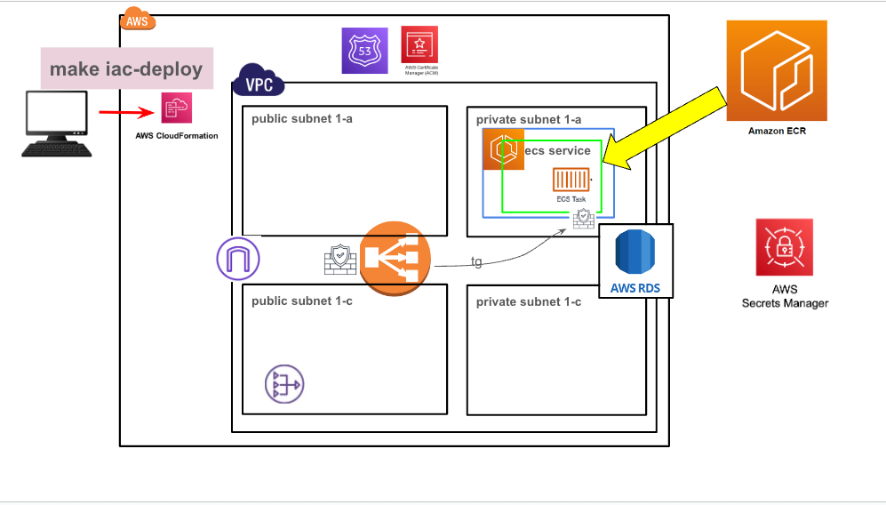
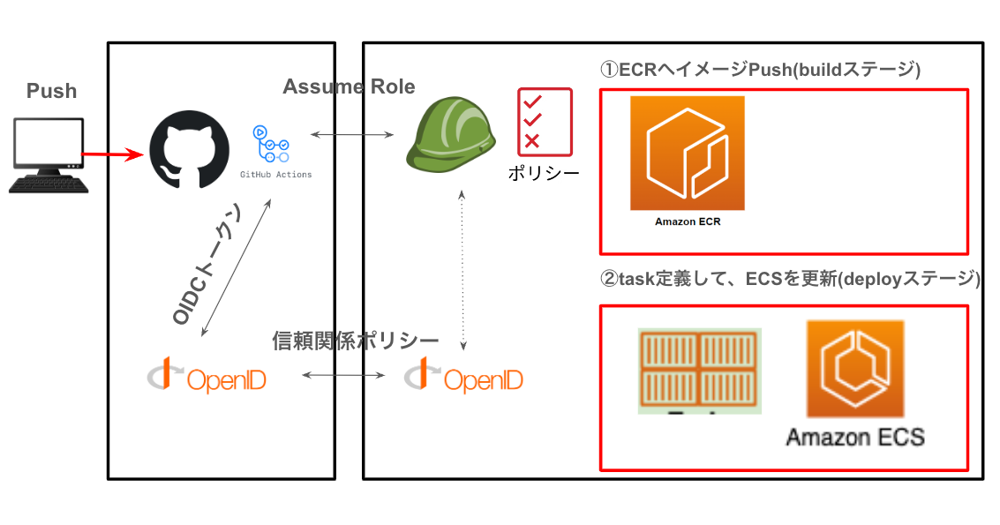
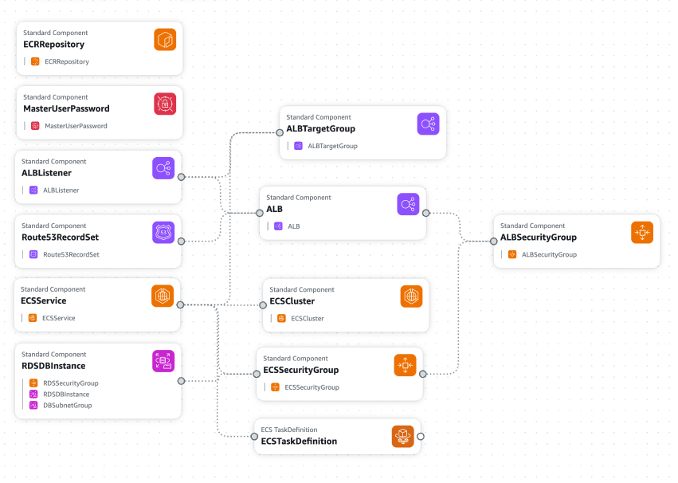
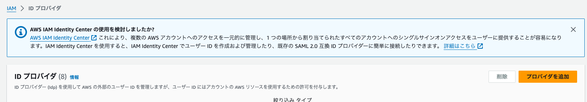
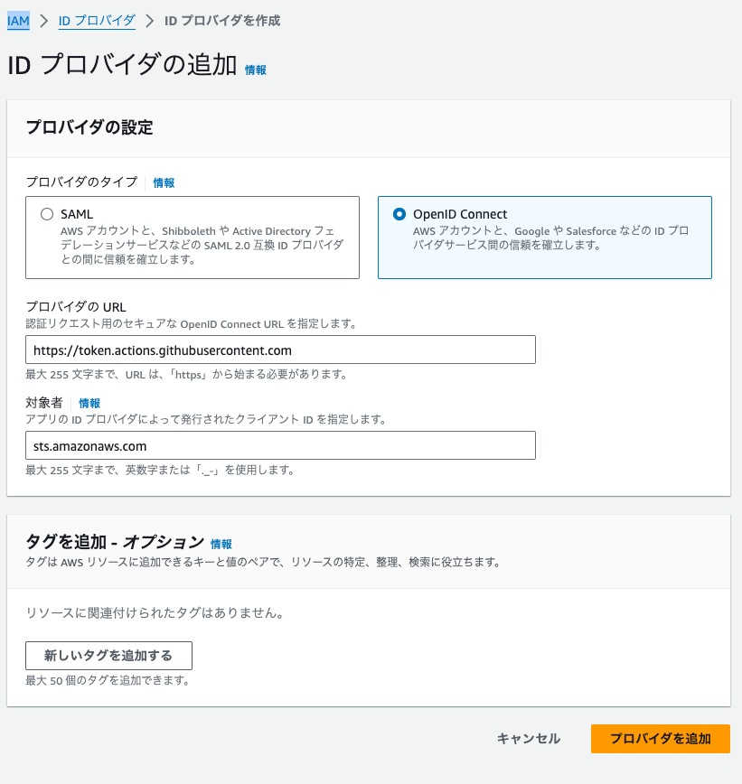
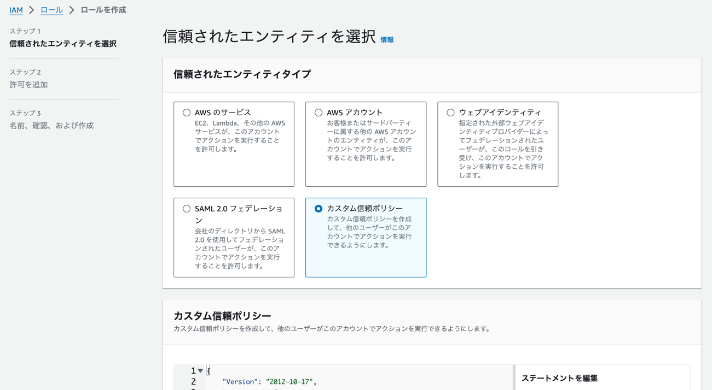
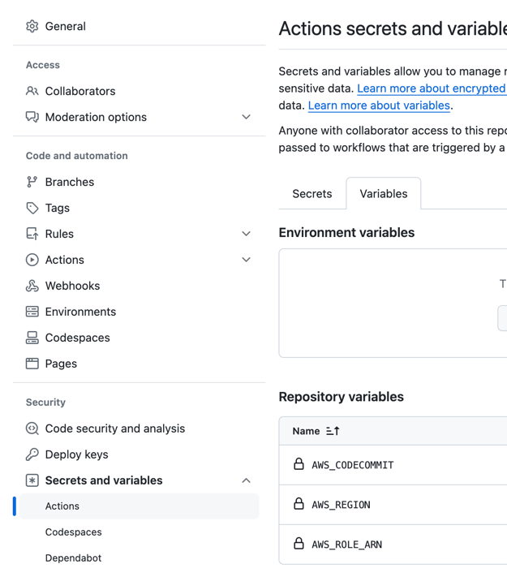
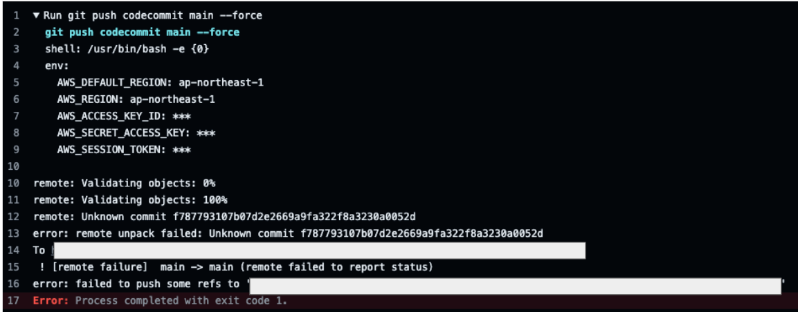

# AWS-cloudFormation

<details open="open">
<summary>目次</summary>


- [今回のシステム概要図](#今回のシステム概要図)
- [直接codecommit](#直接codecommit)
- [githubのPushをトリガーにOIDC認証してcodecommitへPushする](#githubのPushをトリガーにOIDC認証してcodecommitへPushする)
- [githubのPushをトリガーにOIDC認証してTask定義＆サービス更新実施](#githubのPushをトリガーにOIDC認証してTask定義＆サービス更新実施)
- [使用方法(cloudformation+ecrに直接push)](#使用方法(cloudformation+ecrに直接push))
- [使用方法(cloudformation起動＆githubActions)](#使用方法(cloudformation起動＆githubActions))
- [備考](#備考)
- [参考](#参考)
</details>

# 今回のシステム概要図
<details>
<summary> システム概要図</summary>

下記は既存の前提（cloudformationで立ち上げない）
- vpc
- サブネット
- igw
- ngw
- route53ホストゾーン
- ACM証明書

下記サービスを/cloudformation/cloudformation-template.ymlで立ち上げる
- ALB
- ALBのリスナー（設定時に既存のACM使用）
- Route53でAレコード追加してALBにルーティング
- ターゲットグループ（taskで立ち上がるコンテナへルーティング）
- ECSクラスター
- ECSサービス
- ECS task (ECRのイメージを使用)
- IAMロール（ECSのtask定義で使用）
- ECRのリポジトリ
- ALB/ECS/RDSのセキュリティーグループ
- RDS(postgresql)
- SecretsManager(RDSの認証管理、SpringBootのyml切り替え)





</details>


# 直接codecommit

<details>
<summary> 1. codecommitに直接Pushしたい場合の設定</summary>

- 下記の設定だけでもダメかも。２回目はPushできなかった。初回はPushできるけど。。。
- 下記コマンドでAWSの設定をする

```zh
git config credential.helper '!aws codecommit credential-helper $@'
git config credential.UseHttpPath true
```

- 下記コマンドでAWSのcodecommitのURL git remoteに追加する

```zh
   git remote add codecommit https://git-codecommit.ap-northeast-1.amazonaws.com/v1/repos/[codecommit_repository_name]
```

</details>

# githubのPushをトリガーにOIDC認証してcodecommitへPushする

<details>
<summary> 1. IAMでIDプロバイダーを登録</summary>

- IAMからプロバイダを登録




</details>

<details>
<summary> 2. IAMロールを登録する</summary>

- IAMロールから、認証認可後のIAMロールを作成
- 下記jsonをIAMロールの信頼ポリシーに定義。

```json
{
    "Version": "2012-10-17",
    "Statement": [
        {
            "Sid": "",
            "Effect": "Allow",
            "Principal": {
                "Federated": "arn:aws:iam::<AWS ID>:oidc-provider/token.actions.githubusercontent.com"
            },
            "Action": "sts:AssumeRoleWithWebIdentity",
            "Condition": {
                "StringEquals": {
                    "token.actions.githubusercontent.com:sub": "repo:<user-name(github)>/<repository-name(github)>:ref:refs/heads/main",
                    "token.actions.githubusercontent.com:aud": "sts.amazonaws.com"
                }
            }
        }
    ]
}
```

- 上記で作成したIAMロールに下記のIAMポリシーをアタッチする

```json
{
	"Version": "2012-10-17",
	"Statement": [
		{
			"Effect": "Allow",
			"Action": [
				"codecommit:GitPull",
				"codecommit:GitPush"
			],
			"Resource": "arn:aws:codecommit:ap-northeast-1:<AWS ID>:<codecommit-repository-name>"
		}
	]
}
```



</details>

<details>
<summary> 3. github-ci.ymlを記入</summary>

- 下記のコードを記入

```application.yml
name: Sync to CodeCommit

on:
  push:
    branches:
      - main # 監視するブランチを指定

permissions:
  id-token: write
  contents: read

jobs:
  sync:
    runs-on: ubuntu-latest
    steps:
      - name: Git clone the repository # リポジトリの内容をクローン。後続でアクセスできるようになる。 fetch-depth:0は完全なクローンを意味する
        uses: actions/checkout@v4
        with:
          fetch-depth: 0

      - name: configure aws credentials # 認証認可のための部分。role-to-assumeで認証後に引き受けるIAMロールが指定される
        uses: aws-actions/configure-aws-credentials@v4
        with:
          role-to-assume: ${{ vars.AWS_ROLE_ARN }}
          aws-region: ${{ vars.AWS_REGION }}

      - name: Configure git to use AWS CodeCommit credentials
        run: |
          git config --global credential.helper '!aws codecommit credential-helper $@'
          git config --global credential.UseHttpPath true

      - name: Add CodeCommit remote
        run: |
          git remote add codecommit https://git-codecommit.${{ vars.AWS_REGION }}.amazonaws.com/v1/repos/${{ vars.AWS_CODECOMMIT }}

      - name: push to CodeCommit
        run: |
          git push codecommit main
```

- 環境変数をgithubの該当するリポジトリーから設定。
- 下記のようなActionsエラーの時は、checkoutでdepth 0にして完全なコピーをすること


<br>


</details>

# githubのPushをトリガーにOIDC認証してTask定義＆サービス更新実施

<details>
<summary> 1. task定義ファイルをおく</summary>

- 後で、githubActionsから | jq　を用いて既存ファイルの一部を上書きに行く（今回別にいらないかも）

</details>

<details>
<summary> 2. github-ci.ymlを定義</summary>

- まずは、buid-imageしてECRへPush
- その次にdeploy工程。現存のtaskDefinitionを一時的に上書きして、サービスを更新。念のためにログで見れるようにecho , catコマンド使用
- github認証認可後のIAMロールには、ECR & ECSへのアクセス権限が付与されていること

</details>

<details>
<summary> 3. シークレットマネージャーで下記が必要（DB使用のため）</summary>

- username : cloudformationで自動で作成
- password : cloudformationで自動で作成
- POSTGRES_URL : 手動で入力必要
- sandbox : 手動で入力必要 (今回の場合は、sandbox)


- 上記に伴って、taskdefinitionの部分でシークレットを読めるようにすること！
- ECSのtaskロールは、cloudformationで起動時に、DB用に作成したsecretsManagerはアクセスを許可するポリシーを入れている。OutputsでSecretsManagerのARNを動的に取得

</details>

# 使用方法(cloudformation+ecrに直接push)

<details>
<summary> 1. 環境変数の設定</summary>

下記環境変数が必要先に設定する
- AWS_ACCESS_KEY_ID
- AWS_SECRET_ACCESS_KEY
- AWS_SESSION_TOKEN
- AWS_DEFAULT_REGION
- VPC_ID (既存のVPC)
- SUBNET_ID1　（既存のパブリックサブネット１）
- SUBNET_ID2　（既存のパブリックサブネット２）
- SUBNET_PRIVATE_ID1　（既存のプライベートサブネット１）
- SUBNET_PRIVATE_ID2 （既存のプライベートサブネット２）
- EXISTING_ECS_TASK_ROLE_ARN　（cloudformationで作成するECStask用のIAMロールARN。make build-image-pushで使用）
- HOSTED_ZONE_ID (Aレコード追加したいホストゾーン)
- DOMAIN_NAME　(使用したいFQDN。サブドメインだけでなく、FQDNで指定)
- ACM_CERTIFICATE_ARN (使用したい証明書のARN)
- ECR_IMAGE　（ECRのイメージURI）
- ECR_ENDPOINT　（ECRの共通エンドポイント。リポジトリー名は含まない）
- ECR_REPOSITORY_NAME　（ECRのリポジトリー名）
- ECS_CLUSTER_NAME　（ECSのクラスター名）
- ECS_SERVICE_NAME　（ECSのサービス名）
- TASK_DEFINITION_FAMILY　（ECSのタスク定義名）
- CONTAINER_NAME　（ECSのタスクで立ち上げるコンテナ名）

```zh
export 変数名=変数値
```

</details>

<details>
<summary> 2. cloudFormationを使用して環境を立ち上げる</summary>

- 下記コマンドでcloudFormationを起動して環境を立ち上げる

```zh
make iac-deploy
```
</details>

<details>
<summary> 3. cloudFormationに変更があった場合</summary>

- 下記コマンドでcloudFormationを既存の環境にUPDATEをかける

```zh
make iac-update
```
</details>

<details>
<summary> 4. コードを変更してECSサービスを更新する</summary>

- ルートディレクトリのDockerfileを用いて、フロントエンドをバックエンドに巻き込んだDockerイメージを作成
- 下記コマンドにてイメージをECRにPush＆タスク定義をしてサービスの更新

```zh
make build-image-push
```

- task定義のCPUとメモリが小さいと、タスクは１００％完了してもターゲットグループのヘルスチェックで失敗してIPの付け替えができない事象が発生。
- 上記はデプロイされたりされなかったりで不安定だった。少し余裕持っても良いかも

</details>

# 使用方法(cloudformation起動＆githubActions)

<details>
<summary> 1. cloudFormationでインフラを起動</summary>

- awsのアクセスキーなどを一旦環境変数で定義
- 他の環境変数も定義
- 初回はECRにコンテナイメージが入っていないので、DummyとしてNGINXを8080ポートで起動するtaskDefinitionを作成
- 下記コマンドでインフラ起動

```zh
make iac-deploy
```

</details>


<details>
<summary> 2. githubActionsを通して、AWSへデプロイ</summary>

### githubActionsに下記の環境変数を入れる

- AWS_ROLE_ARN
- AWS_REGION
- AWS_ECR_REPOSITORY
- AWS_EXISTING_ECS_TASK_ROLE_ARN
- AWS_ECR_DOMAIN

### はまったポイント

- deployの方でも、taskDefinitionをみにいきたいので、actions/checkoutが必要
- 既存のtaskDefinitionを上書きする
- 普通にgithubのmainブランチにPushするとあとは走る

</details>

# 備考

<details>
<summary> 1. githubにPushできなくなった場合</summary>

- 認証トークンがおかしなことなってるのかな？とりあえず下記でなおった


- githubにPushできなくなったら下記を打つ
- your_tokenの部分はsettingからとってくる

```zh
git remote set-url origin https://YOUR_TOKEN@github.com/your_username/your_repository.git 
```
</details>

<details>
<summary> 2. なかなかcodecommitへPushできなかった</summary>


- 下記のwithがめっちゃ大事。
```zh
    steps:
      - name: Git clone the repository
        uses: actions/checkout@v4
        with:
          fetch-depth: 0
```
</details>

# 参考

[githubOIDC](https://zenn.dev/kou_pg_0131/articles/gh-actions-oidc-aws)
<br/>
[githubOIDCエラー](https://zenn.dev/trkdkjm/articles/f8fcc38c3cf690)