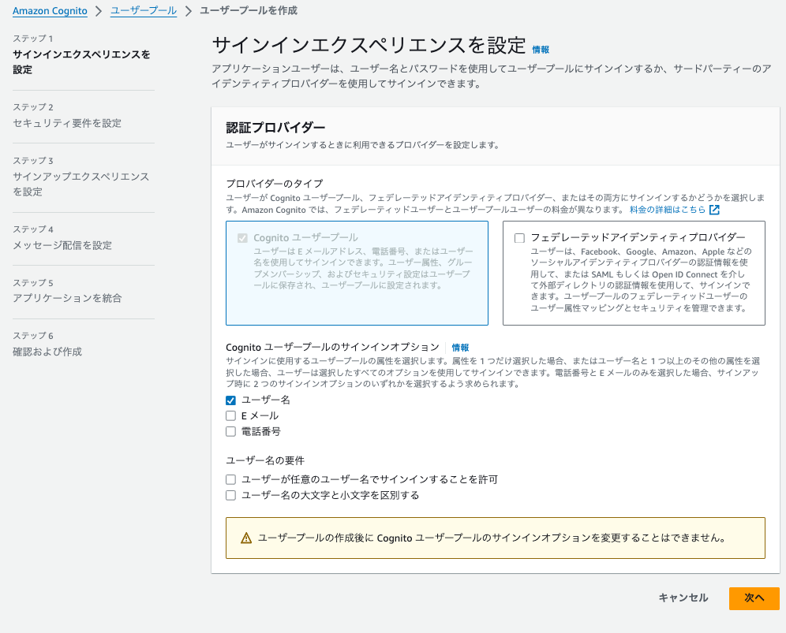
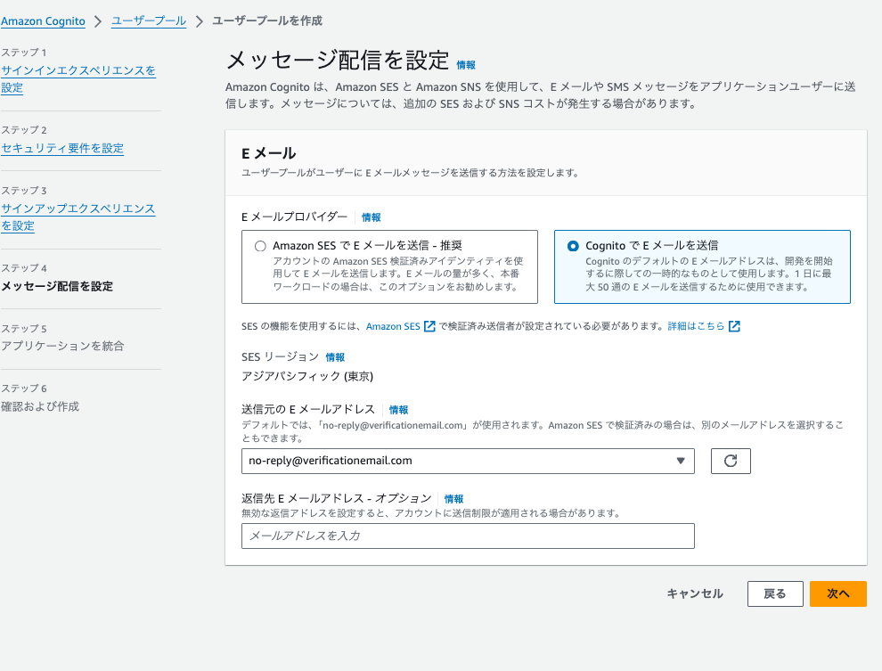
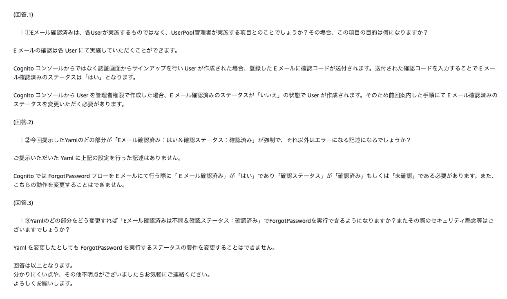
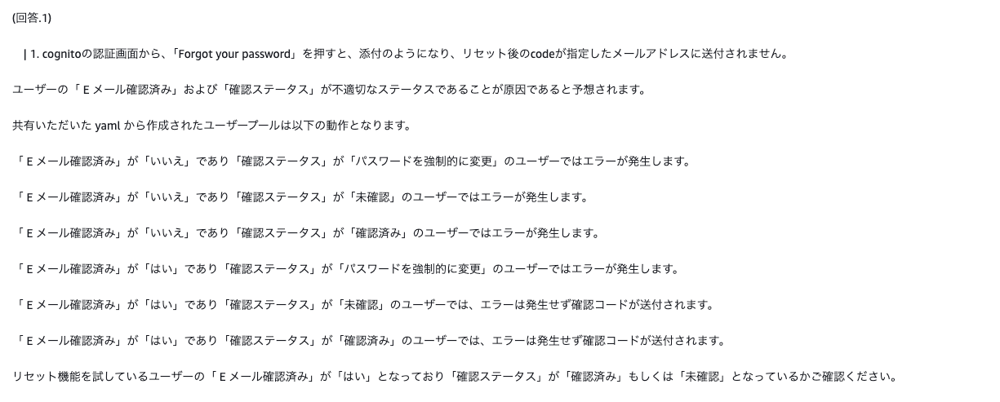
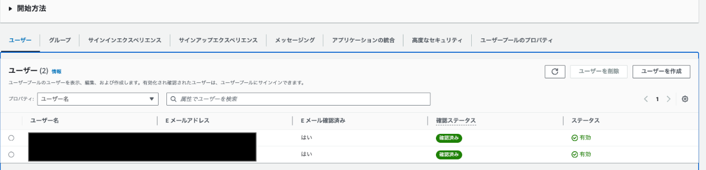
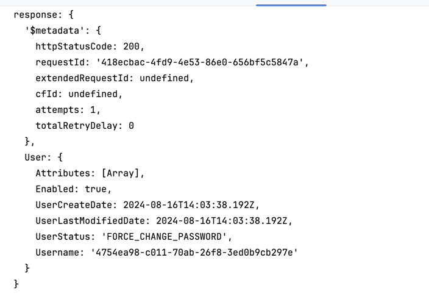

# AWS-COGNITO

<details open="open">
<summary>目次</summary>


- [今回のシステム概要図](#今回のシステム概要図)
- [cognitoの設定](#cognitoの設定)
- [作業手順](#作業手順)
- [備考](#備考)
- [参考](#参考)
</details>

# 今回のシステム概要図
<details>
<summary> システム概要図</summary>

下記をcloudformation-baseで立ち上げ
- vpc
- サブネット
- igw
- ngw
- githubActions用のAssumeロール

下記をcloudformation-template.ymlで立ち上げる
- ALB
- ALBのリスナー
- Route53でAレコード追加してALBにルーティング
- ターゲットグループ（taskで立ち上がるコンテナへルーティング）
- ECSクラスター
- ECSサービス
- ECS task (ECRのイメージを使用)
- IAMロール（ECSのtask定義で使用）
- ECRのリポジトリ
- ALB/ECS/RDSのセキュリティーグループ
- SecretsManager

</details>


# cognitoの設定

<details>
<summary> 1. 特に別のIdPと連携しないなら、チェックなしで次に</summary>



</details>

<details>
<summary> 2. MFA認証は入れる方がおすすめ</summary>


</details>

<details>
<summary> 3. とりあえずエラーが出るのでCognitoの方を設定</summary>



</details>

<details>
<summary> 4. アプリケーションとの統合部分（やること多い）</summary>

- ホストされた認証ページにチュックを入れて、springsecurityのauthorize-urlからアクセスできるCognitoドメインの作成
- 秘密クライエントにチェックを入れて、シークレットの生成
- コールバックURIの登録
- スコープをopenIDで設定（できるだけ少ない情報にしたかった）
- 実際に取れそうなPrincipalは下記の添付


</details>

# 作業手順

<details>
<summary> 1. cloudformation-baseをデプロイ</summary>

- リージョンの設定と、アクセスキーの情報だけ環境変数で必要

```zh
export AWS_DEFAULT_REGION=ap-northeast-1
```

</details>

<details>
<summary> 2. 各種環境変数を設定</summary>

- 実行ターミナルに下記の環境変数を設定

```zh
export AWS_DEFAULT_REGION=hogehoge
export GITHUB_ACCOUNT=hogehoge
export GITHUB_REPOSITORY=hogehoge
export VPC_ID=1で作成したやつ
export SUBNET_ID1=1で作成したやつ
export SUBNET_ID2=1で作成したやつ
export SUBNET_PRIVATE_ID1=1で作成したやつ
export SUBNET_PRIVATE_ID2=1で作成したやつ
export EXISTING_ECS_TASK_ROLE_ARN=hogehoge
export HOSTED_ZONE_ID=hogehoge
export DOMAIN_NAME=hogehoge
export ACM_CERTIFICATE_ARN=hogehoge
export ECR_IMAGE=hogehoge
export ECR_ENDPOINT=hogehoge
export ECR_REPOSITORY_NAME=hogehoge
export ECS_CLUSTER_NAME=hogehoge
export ECS_SERVICE_NAME=hogehoge
export TASK_DEFINITION_FAMILY=hogehoge
export CONTAINER_NAME=hogehoge
```

</details>

<details>
<summary> 3. IAMロールの作成</summary>

- cloudformation-iam-role.ymlをデプロイ

</details>

<details>
<summary> 4. cloudformation-templateをデプロイ</summary>

- cloudformation-templateをデプロイ

</details>

<details>
<summary> 5. cognitoをデプロイ</summary>

- cloudformation-cognito.ymlをデプロイ

</details>


<details>
<summary> 6. new-task-defを更新してPush</summary>

- new-task-defの更新。特に環境変数に気をつけて。AWS上でも必要なシークレットを追加してね。

</details>

# 備考

- 先にACMで証明書発行が必要
- cognitoの認証画面でパスワードをリセットするには「「 E メール確認済み」が「はい」となっており「確認ステータス」が「確認済み」もしくは「未確認」となっているが必須」





- cognitoで新規User登録した際のresponseに入っているデータ




# 参考
